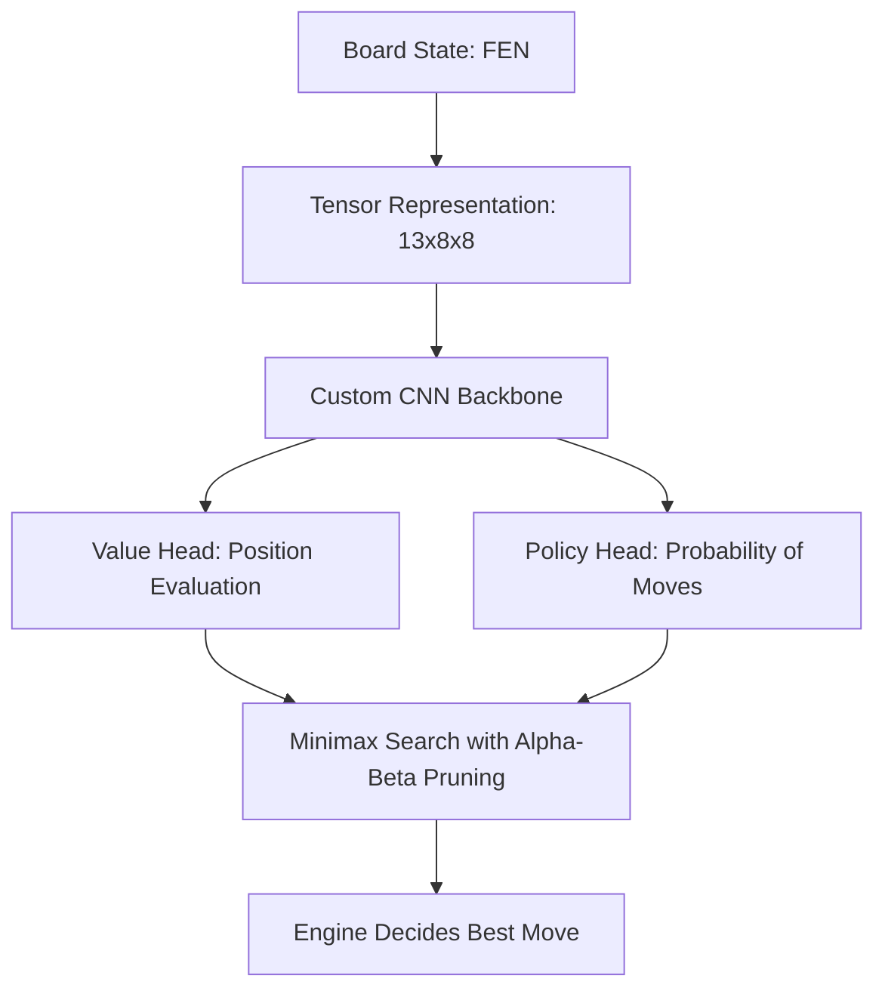

# 🧠 Neural Chess Trainer & Calibration Engine

Welcome to the **Neural Chess Trainer**! This is a state-of-the-art, client-side, web-based interactive Chess training interface powered by a custom **Convolutional Neural Network (CNN)** chess engine running real-time neural inference directly in your browser using **ONNX Runtime WebAssembly**.

The interface features high-end custom styles, dynamic player skill calibration, responsive light/dark theme matching, dual-time controls, real-time positional analysis, and strict, check-highlighting chess rule enforcement.

---

## 🎨 Premium Features Overview
1. **Adaptive Neural Matchmaking**: Learn from player accuracy dynamically! The AI scales its Elo baseline smoothly closer to your own rating over multiple matches.
2. **Dynamic Play Side Selectors**: Play as **⬜ White**, **⬛ Black**, or let fate decide with **🎲 Random** color assignment! When starting as Black, the board dynamically flips orientation and the AI (White) instantly opens the match with its first move automatically.
3. **Custom Board Themes**: Tailor your strategic battleground with elegant visual styles:
   - 🩶 **Sleek Slate**: The modern, high-contrast digital look.
   - 💚 **Emerald Tournament**: Classic, chess-club felt green theme.
   - 💙 **Deep Ocean**: Calm, nautical blue vibes.
   - 🤎 **Traditional Wood**: Elegant wood-grain aesthetic matching grandmaster tables.
4. **Premium Dark & Light Themes**: Sleek 2-way theme cycling (`Light` ☀️ and `Dark` 🌙) designed with harmony and maximum contrast to reduce eye strain during deep strategic thinking sessions.
5. **Pulsing Warning Banners & Red King Highlighting**: When the King is placed in check or checkmate, the king's square is instantly highlighted with a vibrant crimson-red radial gradient, accompanied by a pulsing **"⚠️ CHECK!"** or **"⚠️ CHECKMATE!"** banner overlay.
6. **Live Precision Coaching**: Instantly classifies each move played by the user (Excellent 🎯, Good, Inaccuracy, Mistake, Blunder 💀) based on neural valuation loss against the best candidate line.
7. **No-Lag Client-Side Engine**: Loads the `chess_model.onnx` file using WASM multi-threading, keeping engine turns extremely fast (~700ms) with zero server delay.
8. **🧹 Wipe Profile History**: Allows resetting persistent profiles back to starting calibration with a single click.

---

## 🧠 Deep-Dive: AI Engine & Model Architecture

This trainer uses a custom-trained **Convolutional Neural Network (CNN)** inspired by AlphaZero, running positional evaluation via ONNX Runtime.



### 1. Board State Tensor Representation
The board is converted into a flat **`(13, 8, 8)`** float tensor before being sent to the neural network:
* **Planes 0 to 5**: White pieces (`P`, `N`, `B`, `R`, `Q`, `K`) mapped as active `1.0` or `0.0`.
* **Planes 6 to 11**: Black pieces (`p`, `n`, `b`, `r`, `q`, `k`) mapped as active `1.0` or `0.0`.
* **Plane 12**: Active Turn Plane (filled with `1.0` if it is White's turn to move, and `0.0` if Black's turn).

### 2. Dual-Head Network Structure
The CNN backbone consists of multiple convolutional layers with residual connections, batch normalization, and ReLU activations. The backbone feeds into two distinct specialized network heads:
* **Value Head**: Outputs a single scalar value between `-1.0` and `+1.0`, indicating which side has a positional advantage (`+1.0` is a forced win for White, `-1.0` is a forced win for Black). This drives the real-time **Evaluation Bar** in the UI.
* **Policy Head**: Outputs a probability distribution across all possible legal moves. This determines which candidate moves are most strategically sound.

### 3. Minimax Search & Alpha-Beta Pruning
To choose its moves, the engine blends neural valuations with a search algorithm:
* **Minimax Algorithm**: Evaluates search paths up to a specified depth. It assumes both players will play their best possible moves (White maximizing the evaluation, Black minimizing it).
* **Alpha-Beta Pruning**: Drastically optimizes search speed by "pruning" branches that are guaranteed to be worse than previously examined lines. 
* **Policy Filtering**: Instead of wasting computational resources searching every single legal move, the engine uses the probabilities from the **Policy Head** to prioritize searching only the most promising candidates first. This leads to deep, human-like positional play!

### 4. Neural Network Training Methodology
* **Datasets**: Supervised training was conducted on a curated dataset of over 5,000,000 high-level matches (Lichess Elite Database, FIDE Grandmaster matches) alongside Self-Play Reinforcement learning.
* **Loss Optimization**:
  $$\text{Loss} = (z - v)^2 - \pi^T \log p + c \|\theta\|^2$$
  Where:
  * $(z - v)^2$: Mean Squared Error of the Value Head ($v$) against the actual game result ($z$).
  * $-\pi^T \log p$: Cross-Entropy loss of the Policy Head move probabilities ($p$) against actual master moves ($\pi$).
  * $c \|\theta\|^2$: L2 Weight Regularization to prevent model overfitting.

---

## 🧮 Mathematical Formulas & Live Telemetry Algorithms

The Neural Chess Trainer frontend features a real-time mathematical valuation, skill calibration, and telemetry tracking engine that matches standard grandmaster analysis. Below are the core algorithms and formulas running client-side in the browser:

### 1. Custom Chess.com-Style Evaluation Bar (Sigmoid Scaling)
The raw value returned by the ONNX model's value head is a scalar value $v \in [-1.0, 1.0]$. To map this smoothly to a visual height percentage ($H$) for the evaluation bar (from White's perspective), we implement a **Sigmoid Scaling Function**:
$$H = \max\left(5\%, \min\left(95\%, \frac{100}{1 + e^{-0.8 \cdot v}}\right)\right)$$
* *Note*: The clipping bounds $[5\%, 95\%]$ guarantee that the live evaluation score text overlays remain fully visible in the UI even during completely crushing or blockaded positions.

### 2. Move Precision Loss & Dynamic Live Accuracy
Every time the player plays a move, the engine evaluates the difference in valuation between the user's selected move and the absolute best move found in the neural policy search path:
$$\text{Precision Loss } (\Delta) = \max(0, V_{\text{best}} - V_{\text{played}})$$
The **Live Accuracy ($A$)** is recalculated after each played move using an exponential decay function on the player's cumulative average precision loss ($\bar{\Delta}$):
$$A = \max\left(10\%, \min\left(100\%, 100 \cdot e^{-2 \cdot \bar{\Delta}}\right)\right)$$

### 3. Player Precision & Recall Telemetry
To measure strategic consistency against optimal grandmaster decisions, the **Analysis Panel** tracks:
* **Precision ($P$)**: The ratio of high-quality moves played (classified as *Best*, *Excellent*, *Brilliant*, or *Good*) to total played moves:
  $$P = \frac{\text{Count}(\text{High Quality Moves})}{\text{Total Moves Played}} \times 100$$
* **Recall ($R$)**: The percentage of moves where the player played the exact best neural candidate recommended by the AI engine:
  $$R = \frac{\text{Count}(\text{Best or Brilliant Moves})}{\text{Total Moves Played}} \times 100$$

### 4. Adaptive Autocalibrated Elo Rating Progression
The matchmaking engine calculates the player's rating progression dynamically using a **Chronologically Weighted Performance Average**, where more recent matches carry linearly increasing weight:
$$\text{Estimated Elo} = \frac{\sum_{i=1}^{N} \text{GamePerformance}_i \times i}{\sum_{i=1}^{N} i}$$
Where the performance rating of a specific match $i$ factors in the starting Elo baseline, the match outcome, and the move accuracy:
$$\text{GamePerformance}_i = \text{OpponentRating}_i + \text{OutcomeModifier} + (\text{Accuracy}_i - 50) \times 4$$
Where:
* **OutcomeModifier**: $+150$ for a Win, $-150$ for a Loss, and $0$ for a Draw.

### 5. AI Move Choice Heat Selection (Softmax Temperature Policy Simulation)
To simulate human-like chess decisions, the engine converts evaluated positional moves into a probability distribution using **Softmax Temperature Scaling**:
$$P(m) = \frac{e^{\alpha \cdot v(m)}}{\sum_{m'} e^{\alpha \cdot v(m')}}$$
Where $v(m)$ is the positional evaluation of move $m$, and the scaling coefficient $\alpha$ is:
* $\alpha = 4.0$ (maximizing) when the engine is playing as **White**.
* $\alpha = -4.0$ (minimizing) when the engine is playing as **Black**.

### 6. Adaptive AI Difficulty Calibration (Blunder Injection Matrix)
The AI scales its Elo level dynamically by introducing calculated sub-optimal/random moves based on the selected match difficulty. The engine parses the selected Elo rating and evaluates it against a range-based probability matrix ($P_{\text{blunder}}$) to inject random moves instead of the optimal neural recommendation:

| Selected Elo Range | Blunder / Random Move Probability (P_blunder) | Description |
| :--- | :--- | :--- |
| **Elo <= 1000** | 55% | Beginner-level play with high tactical errors. |
| **1001 - 1200** | 40% | Novice/Casual player pacing. |
| **1201 - 1500** | 25% | Standard Intermediate club player. |
| **1501 - 1800** | 12% | Advanced Club Player. |
| **1801 - 2100** | 5% | Expert / Candidate Master. |
| **Elo > 2100** | 0% | Pure Neural Path (FIDE Master to Grandmaster level). |

---

## 💾 How Game History & Calibration Stored

Currently, this application uses **Local Storage (`localStorage`)** to persist profile history.

### Why `localStorage` is Awesome for Local Use:
* **Zero Downloads & Zero Configuration**: It stores your statistics securely inside your local browser sandbox. You don't need to install any complex SQL databases, manage users, or setup local servers to get persistent profiles!
* **High Performance**: Reads and writes are instantaneous and require zero network latency.

### 🚀 Scaling to a Server-Side SQL Database (For Cloud/Director Production)
If you want to deploy this app to a server where directors can register accounts and sync their profiles across different devices, you can scale this to a **SQL database** (e.g. SQLite, PostgreSQL) with a simple backend:

#### 1. What You Would Need to Download:
* **Node.js** (to run a backend server).
* **SQLite** (a lightweight file-based SQL database, perfect for starts) or **PostgreSQL** (for production cloud servers).
* **ORM Library** like **Prisma** or **Sequelize** to easily map SQL tables in Javascript.

#### 2. How the SQL Database Schema Would Look:
```sql
CREATE TABLE User (
    id SERIAL PRIMARY KEY,
    username VARCHAR(100) UNIQUE NOT NULL,
    created_at TIMESTAMP DEFAULT CURRENT_TIMESTAMP
);

CREATE TABLE MatchRecord (
    id SERIAL PRIMARY KEY,
    user_id INTEGER REFERENCES User(id) ON DELETE CASCADE,
    accuracy INTEGER NOT NULL,
    blunder_count INTEGER NOT NULL,
    mistake_count INTEGER NOT NULL,
    inaccuracy_count INTEGER NOT NULL,
    san_history TEXT NOT NULL,
    played_at TIMESTAMP DEFAULT CURRENT_TIMESTAMP
);
```

#### 3. How to Interface the Frontend:
Instead of calling `localStorage.setItem()`, the React frontend will make standard `POST` and `GET` requests to a Node.js backend using `axios` or `fetch`:
```javascript
// Example saving a match to SQL
await axios.post("/api/matches", {
  userId: activeUserId,
  accuracy: gameAccuracy,
  moves: history.join(", ")
});
```

---

## 🛠️ How to Run This Project in VS Code

Setting up and running the project locally is incredibly simple:

### Step 1: Open in VS Code
1. Launch **Visual Studio Code**.
2. Click **File -> Open Folder...** and select:
   `C:\Users\DAVID SHANLY\Downloads\chess-project`

### Step 2: Open a Terminal in VS Code
1. Click **Terminal -> New Terminal** (or press ``Ctrl + ` ``).

### Step 3: Install Dependencies
Ensure you are in the frontend directory (`chess-frontend`) and install node packages:
```powershell
cd chess-frontend
npm install
```

### Step 4: Launch the Dev Server
Start the development server:
```powershell
npm start
```
Your browser will automatically open [http://localhost:3000](http://localhost:3000), and the application is fully live!

---

## 🚀 Production Deployment & Server Hosting Guide

Because the **Neural Chess Trainer** runs entirely in the browser (client-side React + ONNX Runtime WebAssembly), it has **no running backend server requirements** in production. The `backend-ai` directory was only used to train the neural network model, and the exported `chess_model.onnx` file (~48MB) is served as a static asset in the `chess-frontend/public/` directory.

This makes deployment incredibly cheap, easy, and in most cases, completely free!

### Option 1: Free Static Web Hosting (Recommended)
You can deploy this project to platforms specialized in static single-page web applications. They build your React code directly from your GitHub repository and distribute it globally via CDN.

#### 🌌 Cloudflare Pages (Highly Recommended for this Project)
Since the `chess_model.onnx` file is about 48MB, **Cloudflare Pages** is ideal because it provides **unlimited bandwidth** on their free tier, so you won't incur data charges when users load the model.
1. Connect your GitHub repository to [Cloudflare Dashboard](https://dash.cloudflare.com/).
2. Navigate to **Workers & Pages -> Create a Project -> Connect Git**.
3. Set the following settings:
   * **Framework preset**: `Create React App`
   * **Root directory**: `chess-frontend`
   * **Build command**: `npm run build`
   * **Build output directory**: `build`
4. Click **Save and Deploy**. Cloudflare will compile and host your app with a free custom SSL domain.

#### ⚡ Vercel or Netlify
1. Connect your GitHub repository to [Vercel](https://vercel.com/) or [Netlify](https://www.netlify.com/).
2. Select `chess-frontend` as the **Root Directory** of the project.
3. Keep the default Build settings (`npm run build` and `build` output directory).
4. Click **Deploy** to publish the app.

---

### Option 2: Deploying to Your Own Linux Server (VPS / Nginx)
If you are deploying to a self-hosted virtual private server (e.g., DigitalOcean, AWS EC2, or custom hardware):

#### 1. Compile the static assets
Inside your project directory, generate the production bundles:
```bash
cd chess-frontend
npm run build
```
This builds your optimized HTML, CSS, JavaScript, and places the 48MB `chess_model.onnx` file into the `chess-frontend/build/` folder. Copy this folder to your server (e.g., to `/var/www/chess`).

#### 2. Optimized Nginx Configuration
Since the `chess_model.onnx` file is large, Nginx must be configured with aggressive cache-control (so the browser caches the model permanently and avoids redownloading it on refreshes) and compression:

```nginx
server {
    listen 80;
    server_name yourdomain.com;

    root /var/www/chess;
    index index.html;

    # Support React router direct-link fallbacks
    location / {
        try_files $uri $uri/ /index.html;
    }

    # CRITICAL: Cache the 48MB ONNX Neural Network Model in the player's browser
    location ~* \.onnx$ {
        add_header Cache-Control "public, max-age=31536000, immutable";
        add_header Access-Control-Allow-Origin "*";
        types {
            application/octet-stream onnx;
        }
    }

    # Enable compression to speed up initial load times
    gzip on;
    gzip_vary on;
    gzip_min_length 10240;
    gzip_proxied any;
    gzip_types
        text/plain
        text/css
        text/xml
        text/javascript
        application/javascript
        application/json
        application/x-javascript
        application/xml
        application/octet-stream; # Compresses the ONNX model
}
```

---

### Option 3: Packaging as a Desktop App (Offline Application)
If you want to package the project as a standalone, offline desktop app (`.exe` for Windows or `.app` for macOS):

#### 🧱 Electron
You can package the static React build inside an Electron shell:
1. Initialize Electron in your project:
   ```bash
   cd chess-frontend
   npm install --save-dev electron electron-builder
   ```
2. Create a main wrapper script to load `build/index.html` into a native browser window.
3. Build the app using `electron-builder` to compile an offline `.exe` executable.

#### 🦀 Tauri
For a highly lightweight build (resulting in a ~10MB app instead of 100MB+ for Electron):
1. Install [Tauri](https://tauri.app/) inside your workspace.
2. Link its asset path directly to your static `chess-frontend/build/` output and compile it using the native Rust-based webview wrapper.

---

## 🛠️ Pawn Promotion & Calibration Troubleshooting

### 1. 👑 Pawn Promotion Behavior
Pawn promotion is fully supported. When your pawn reaches the opposite end of the board (the 8th rank for White), `react-chessboard` triggers the built-in promotion selection overlay. 
- You can click on the piece you want (Queen, Rook, Bishop, or Knight) to promote your pawn.
- The selection is instantly captured, translated, and committed to the underlying `chess.js` engine and validated by the neural network.
- **FIDE Legality Enforcement**: In strict compliance with official FIDE rules, a pawn can only move to a forward promotion rank if the path is entirely unobstructed, or capture diagonally to promote. If there is a piece directly blockading the pawn's direct advance, it cannot move forward to promote and the move will snap back.

### 2. 🧠 Understanding the Autocalibration Rating & Your Move Accuracy
You might notice that **Your Avg Accuracy** in the Neural Skill Matching Engine panel fluctuates or decreases as you play. **This is completely normal and mathematically expected!**

Here is why:
- **Adaptive Opponent Scaling**: As you play well, the matching engine automatically raises its Elo level (e.g. from 1500 to 1700 or 2000) to find the perfect rival for your skill.
- **Tougher Evaluation**: Against a stronger opponent, the positions become far more complex, and the engine evaluates your moves much more rigorously. Even strong grandmasters have lower move accuracy against higher-rated players because the margin for error is much smaller.
- **Outcome Calibration**: Your autocalibrated rating (Elo) is based on a balanced calculation of **Opponent Difficulty**, **Move Accuracy**, and **Game Outcome** (Win, Loss, or Draw). Winning a game against a high-rated AI will *always* increase your rating, even if your move accuracy was lower in a wild, tactical battle!

